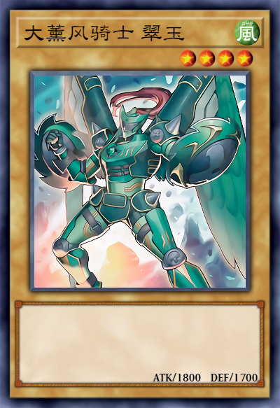

# Card.js v2

<a href="./src/mold.js">参考mold.js</a>

初步方案（求建议）

1. 目标 => 用一个mold.js能够完全渲染出一个静态图片
2. 保持核心代码纯粹，尽量不要加入游戏王的相关逻辑
3. 数据处理部分写在`dataProcess`中，保证具体业务逻辑可插拔
4. render函数能保证在node和browser兼容，且无其他无关逻辑
5. fileLoader内部对图片素材进行必要的缓存
6. fontLoader可以参考<a href="https://developer.mozilla.org/zh-CN/docs/Web/API/FontFace">FontFace</a>，兼容手段可以参考cardjs v1代码

## 当前进度

1. 数据驱动更新。√
2. 局部渲染。√
3. 循环渲染（典型的：等级星星）。√
4. 条件渲染（自定义组件渲染的条件）。√
5. 一些语法糖。比如可以把几个组件相同的部分写在一起,支持嵌套：

```js
// 以下将会被拆分成两个component
{
  type: 'text',
  style: {
    y: 1107,
    width: 72,
    font: 'number',
    fontSize: 36,
    textAlign: 'right',
  },
  inherit: [
    {
      name: '攻击力',
      text: data => data.attack,
      style: { x: 585 },
    },
    {
      name: '防御力',
      text: data => data.defend,
      style: { x: 750 },
    },
  ],
}
```

```js
{
  name: '攻击力',
  type: 'text',
  text: data => data.attack,
  style: {
    x: 585,
    y: 1107,
    width: 72,
    font: 'number',
    fontSize: 36,
    textAlign: 'right',
  },
},
{
  name: '防御力',
  type: 'text',
  text: data => data.defend,
  style: {
    x: 750,
    y: 1107,
    width: 72,
    font: 'number',
    fontSize: 36,
    textAlign: 'right',
  },
}
```

